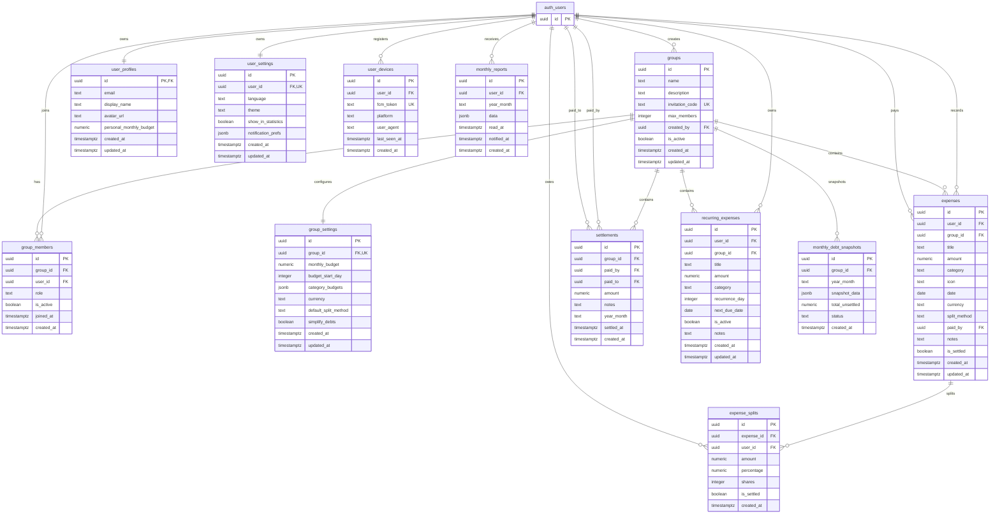

# Database Diagram

This ERD covers the current `group_expense` application tables used by the React 19 rewrite. It is checked against `schema.sql` and the v3 migrations:

- `migrations/v3-01-user-devices.sql`
- `migrations/v3-02-monthly-reports.sql`
- `migrations/v3-03-update-group-expense-rpc.sql`
- `migrations/v3-04-hardening.sql`
- `migrations/v3-05-notification-prefs.sql`
- `migrations/v3-06-notification-triggers.sql`
- `migrations/v3-07-monthly-report-cron.sql`

## ERD

## Consistency Checklist

| Table | Source migration / snapshot | Checked columns |
|---|---|---|
| `groups` | `schema.sql`, v2 schema baseline | `id`, `name`, `description`, `invitation_code`, `max_members`, `created_by`, `is_active`, `created_at`, `updated_at` |
| `group_members` | `schema.sql`, v2 schema baseline | `id`, `group_id`, `user_id`, `role`, `is_active`, `joined_at`, `created_at` |
| `group_settings` | `schema.sql`, v2 schema baseline | `id`, `group_id`, `monthly_budget`, `budget_start_day`, `category_budgets`, `currency`, `default_split_method`, `simplify_debts`, `created_at`, `updated_at` |
| `expenses` | `schema.sql`, v2 schema baseline, `migrations/v3-03-update-group-expense-rpc.sql` | `id`, `user_id`, `group_id`, `title`, `amount`, `category`, `icon`, `date`, `currency`, `split_method`, `paid_by`, `notes`, `is_settled`, `created_at`, `updated_at` |
| `expense_splits` | `schema.sql`, v2 schema baseline, `migrations/v3-06-notification-triggers.sql` | `id`, `expense_id`, `user_id`, `amount`, `percentage`, `shares`, `is_settled`, `created_at` |
| `settlements` | `schema.sql`, v2 schema baseline, `migrations/v3-04-hardening.sql`, `migrations/v3-06-notification-triggers.sql` | `id`, `group_id`, `paid_by`, `paid_to`, `amount`, `notes`, `year_month`, `settled_at`, `created_at` |
| `user_profiles` | `schema.sql`, `migrations/add_personal_budget.sql` | `id`, `email`, `display_name`, `avatar_url`, `personal_monthly_budget`, `created_at`, `updated_at` |
| `user_settings` | `schema.sql`, `migrations/v3-05-notification-prefs.sql` | `id`, `user_id`, `language`, `theme`, `show_in_statistics`, `notification_prefs`, `created_at`, `updated_at` |
| `recurring_expenses` | `schema.sql`, `src/shared/lib/database.types.ts`, v3-04 report-only RLS note | `id`, `user_id`, `group_id`, `title`, `amount`, `category`, `recurrence_day`, `next_due_date`, `is_active`, `notes`, `created_at`, `updated_at` |
| `monthly_debt_snapshots` | `schema.sql`, v2 schema baseline, `src/shared/lib/database.types.ts` | `id`, `group_id`, `year_month`, `snapshot_data`, `total_unsettled`, `status`, `created_at` |
| `user_devices` | `migrations/v3-01-user-devices.sql` | `id`, `user_id`, `fcm_token`, `platform`, `user_agent`, `last_seen_at`, `created_at` |
| `monthly_reports` | `migrations/v3-02-monthly-reports.sql`, `migrations/v3-07-monthly-report-cron.sql` | `id`, `user_id`, `year_month`, `data`, `read_at`, `notified_at`, `created_at` |

All application tables referenced by the React app, generated database types, or current RPC contracts are represented above. `monthly_debt_snapshots` is separate from v3 `monthly_reports`, but it is still used by the settlement snapshot RPCs and React settlement query path.
